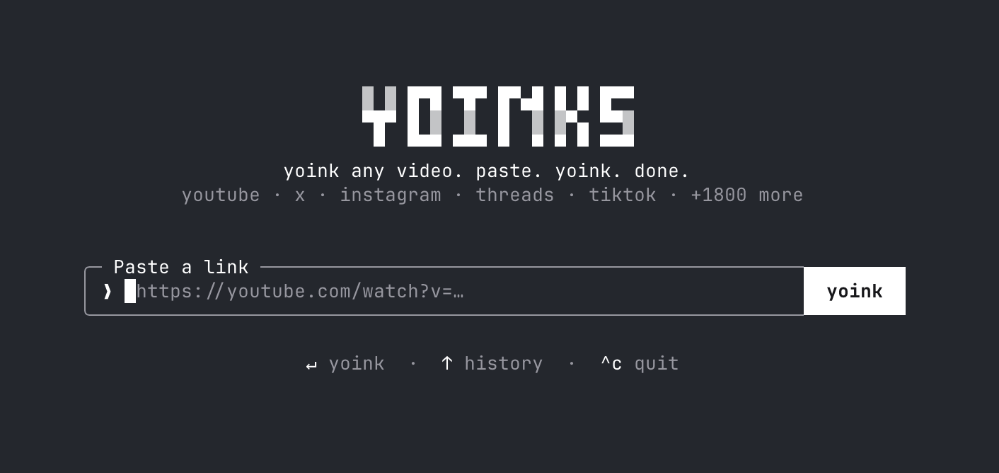
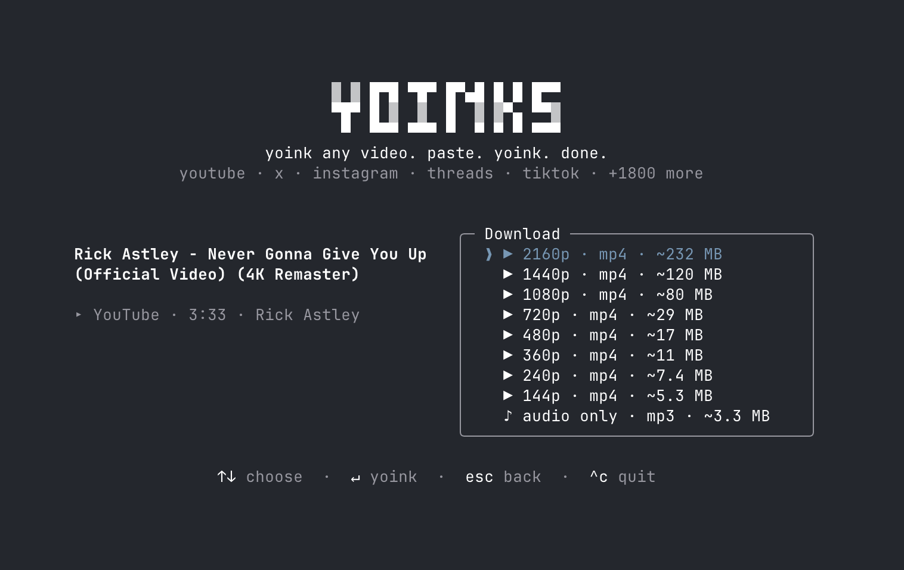

# herlink

<picture>
  <source media="(prefers-color-scheme: dark)" srcset="assets/logo-dark.svg">
  
</picture>

grab any video. paste. grab. done.

Download videos from YouTube, X/Twitter, Instagram, TikTok and
1,600+ other sites — right from your terminal. Paste a url, pick a
resolution (or audio-only mp3), done. No popups, no fake download buttons,
no sketchy redirects.



## Install

```sh
npm install -g herlink
```

Or try it without installing anything:

```sh
npx herlink
```

Requires Node 18+. Everything else (yt-dlp, ffmpeg) is fetched or bundled
automatically.

## Usage

```sh
$ herlink https://youtu.be/dQw4w9WgXcQ    # straight to the format picker
$ herlink                                 # prompts for a url
$ herlink --theme light                   # force the light palette
$ herlink --best https://youtu.be/dQw4w9WgXcQ   # skip the picker, best quality
$ herlink --mp3 https://youtu.be/dQw4w9WgXcQ    # audio-only mp3
$ herlink --file urls.txt                 # batch download (one url per line)
$ herlink "https://youtube.com/playlist?list=..." --best   # whole playlist
```

herlink takes over the terminal (full-screen, centered — and restores your
scrollback on exit). Pick a format with ↑/↓ (or j/k, or number keys) and
hit enter. `esc` goes back, `^c` quits. Or just use the mouse — the grab
button, the format list and the footer hints are all clickable, and
clicking the logo takes you back home. Files are saved to `~/Downloads`,
and the file path is printed to your terminal when you're done.

Multiple urls (or a `--file`) download one after another — you pick the
format for each, `esc` cancels the rest, and interrupted downloads keep
their `.part` files so `--continue` can resume them. Playlist urls offer
a "download all N videos" option (also via `--playlist-start`/`--playlist-end`
range flags).

### Flags

| Flag | What it does |
| --- | --- |
| `--theme <auto\|light\|dark>` | starting theme for one launch |
| `--best` / `--mp3` | scriptable mode: no picker, applies to every url |
| `-o <dir>` | output folder (replaces `~/Downloads` for the run) |
| `--continue` | resume partial downloads (keeps `.part`) |
| `--cookies <file>` | Netscape-format cookies file for login-gated sites |
| `--subs [langs]` | download subtitles (`--subs=es,en`; empty = all languages) |
| `--embed-metadata` | embed title/thumbnail/metadata (requires ffmpeg) |
| `--no-update` | skip the bundled yt-dlp self-update for one run |
| `--file <file>` | read urls from a file (one per line) |
| `-h` / `-v` | help / version |

The `auto` theme resolves to the matte-black dark palette — the app's
primary environment is a dark Termux terminal. Press `^t` or click the
theme control in the footer to cycle through `auto`, `light`, and `dark`
for the current session.



## How it works

- Powered by [yt-dlp](https://github.com/yt-dlp/yt-dlp). On first run,
  herlink downloads the standalone yt-dlp binary to `~/.herlink/bin` —
  no Python required. If you already have yt-dlp installed, it uses yours.
- ffmpeg (needed for merging high-res streams and mp3 extraction) is found
  on your PATH, with `ffmpeg-static` as a bundled fallback.
- The UI is [Ink](https://github.com/vadimdemedes/ink) — React for the
  terminal.

## Development

```sh
npm install
npm run build        # bundle to dist/ with tsup
npm run dev          # rebuild on change
node dist/cli.js <url>
npm run typecheck
```

To try it as a global command without publishing: `npm link`, then run
`herlink` anywhere.

## Roadmap

- [ ] Clipboard detection: launch bare and auto-suggest the url you copied
- [ ] `curl herlink.sh | sh` installer
- [x] Publish to npm (`npm i -g herlink` / `npx herlink`)
- [x] `--best` / `--mp3` flags to skip the picker (scriptable mode)
- [x] `-o <dir>` to choose the output folder
- [x] Batch queue: multiple urls / `--file`, sequential downloads
- [x] Playlist and thread-with-multiple-videos support
- [x] Resume (`--continue`), cookies (`--cookies`), subtitles (`--subs`),
      metadata embedding (`--embed-metadata`)
- [x] Self-update for the bundled yt-dlp binary (`yt-dlp -U`, silent)

## A note on fair use

herlink is a personal-archiving tool. Downloading content may violate a
platform's terms of service — only download what you have the right to
keep, and be excellent to creators.

## License

[MIT](LICENSE)
