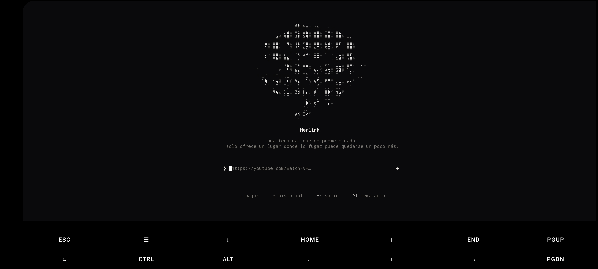

# Herlink

<div align="center">

Download videos and audio from **YouTube, X/Twitter, Instagram, TikTok and 1,600+ sites** — right from your terminal.

[](LICENSE)
[](https://nodejs.org/)
[](https://www.npmjs.com/package/herlink)

</div>



Paste a URL, pick a resolution (or audio-only MP3), done. No popups, no fake download buttons, no sketchy redirects.

---

## Table of Contents

- [Features](#features)
- [Quick Start](#quick-start)
- [Installation](#installation)
- [Usage](#usage)
- [Flags reference](#flags-reference)
- [How It Works](#how-it-works)
- [Roadmap](#roadmap)
- [Development](#development)
- [Contributing](#contributing)
- [License](#license)
- [Contact](#contact)

---

## Features

- **1600+ sites** — YouTube, X/Twitter, Instagram, TikTok, and more.
- **Interactive TUI** — paste a URL and pick a resolution, quality, or MP3 from a mouse + keyboard driven picker.
- **Parallel downloads** — multiple URLs at once, each with its own progress bar.
- **MP3 extraction** — grab just the audio as high-quality MP3 with embedded cover art *by default*.
- **Embedded metadata + cover art on by default** — every download gets title, thumbnail and metadata baked in (requires ffmpeg).
- **Resume** — interrupted downloads pick up where they left off with `--continue`.
- **Subtitles** — download subtitles for your chosen languages.
- **Cookies** — sign into login-gated sites with `--cookies`.
- **Scriptable** — drop the picker and use `--best` / `--mp3` straight from a shell script.
- **No Python required** — ships and manages its own yt-dlp binary, with your system version used when present.

<p align="right">(<a href="#readme-top">back to top</a>)</p>

---

## Quick Start

```sh
npm install -g herlink

# Launch the picker with a URL
herlink https://youtu.be/dQw4w9WgXcQ

# Just run it — it detects a copied URL from your clipboard
herlink

# Grab the best download with no interaction
herlink --best https://youtu.be/dQw4w9WgXcQ

# Audio only, as MP3
herlink --mp3 https://youtu.be/dQw4w9WgXcQ

# Batch-download a list of URLs
herlink --file urls.txt
```

<p align="right">(<a href="#readme-top">back to top</a>)</p>

---

## Installation

### Prerequisites

- **[Node.js](https://nodejs.org/) 18+**
- **[yt-dlp](https://yt-dlp.org/)** — bundled and managed on first run; your system version is used if already installed.
- **[ffmpeg](https://ffmpeg.org/)** — required for merging high-resolution streams, MP3 extraction, and embedding metadata/cover art.

### Install globally (recommended)

```sh
npm install -g herlink
```

### Run without installing

```sh
npx herlink
```

### Install from source

```sh
git clone https://github.com/WilberHernan/Herlink.git
cd Herlink
npm install
npm run build
npm link        # exposes the `herlink` command
```

Downloads land in `~/Downloads` by default — on **Termux** they go to `~/storage/shared/Download/Downlink` (visible in the Android Downloads app).

<p align="right">(<a href="#readme-top">back to top</a>)</p>

---

## Usage

### Just type `herlink`

Run `herlink` with no arguments and it opens the interactive picker. If you've copied a URL, **Herlink detects it and offers to paste it** — just press <kbd>Tab</kbd> to use what's on your clipboard.

### Launch with a URL

```sh
herlink https://youtu.be/dQw4w9WgXcQ
```

The picker shows available formats. Use <kbd>↑</kbd>/<kbd>↓</kbd> or <kbd>j</kbd>/<kbd>k</kbd>, the mouse, or number keys to select. <kbd>Enter</kbd> downloads, <kbd>Esc</kbd> goes back, <kbd>Ctrl+C</kbd> quits.

### Scriptable mode (no picker)

Pass one or more URLs (or `--file`) with `--best` or `--mp3` to skip the picker entirely — great for scripts and headless use.

```sh
herlink --best https://youtu.be/dQw4w9WgXcQ
herlink --mp3 https://www.youtube.com/watch?v=dQw4w9WgXcQ  # audio-only MP3 + cover art
herlink --best --embed-metadata https://youtu.be/dQw4w9WgXcQ
```

> `--best` and `--mp3` are mutually exclusive and need at least one URL or a `--file`.

### Multiple URLs

Pass as many URLs as you like — they download in parallel:

```sh
herlink https://youtu.be/a https://youtu.be/b https://youtu.be/c
```

<p align="right">(<a href="#readme-top">back to top</a>)</p>

---

## Flags reference

| Flag | Description |
| ---- | ----------- |
| `herlink` | launch the picker; auto-suggests a copied URL (Tab to paste) |
| `--theme <auto\|light\|dark>` | theme for this run |
| `--best` | scriptable: best-quality download, no picker |
| `--mp3` | scriptable: audio-only MP3, no picker |
| `-o <dir>` | output folder (overrides `~/Downloads`) |
| `--continue` | resume partial downloads (keeps/uses `.part` files) |
| `--cookies <file>` | Netscape-format cookies file for login-gated sites |
| `--subs [langs]` | download subtitles (`--subs=es,en`; empty = all languages) |
| `--embed-metadata` | embed title/thumbnail/metadata (on by default, requires ffmpeg) |
| `--no-embed-metadata` | turn off the default metadata/cover-art embedding |
| `--no-update` | skip the bundled yt-dlp self-update for this run |
| `--retries <n>` | download retries (default 10) |
| `--fragment-retries <n>` | fragment retries (default 10) |
| `--retry-sleep <val>` | wait between retries (default 1, e.g. `fragment:exp=1:20`) |
| `--socket-timeout <n>` | socket timeout in seconds (default 30) |
| `--download-archive <file>` | archive file to skip already-downloaded entries (default `~/.herlink/archive.txt`) |
| `--break-on-existing` | stop queue when an archive entry already exists (requires `--download-archive`) |
| `--file <file>` | read URLs from a file (one per line) |
| `-h`, `--help` | show help |
| `-v`, `--version` | show version |

### Examples

Download a playlist in batch:

```sh
herlink "https://youtube.com/playlist?list=..." --best --file playlist.txt
```

Download a login-gated video with cookies:

```sh
herlink --cookies cookies.txt https://youtu.be/dQw4w9WgXcQ
```

Resume an interrupted download:

```sh
herlink --continue https://youtu.be/dQw4w9WgXcQ
```

Grab Spanish and English subtitles:

```sh
herlink --subs=es,en https://youtu.be/dQw4w9WgXcQ
```

<p align="right">(<a href="#readme-top">back to top</a>)</p>

---

## How It Works

- Powered by **[yt-dlp](https://github.com/yt-dlp/yt-dlp)**. On first run Herlink downloads the standalone yt-dlp binary into `~/.herlink/bin` — no Python required. If you already have yt-dlp installed, it uses yours and keeps it fresh.
- **[ffmpeg](https://ffmpeg.org/)** — found on your `PATH`, with a `ffmpeg-static` bundled fallback — merges high-resolution streams, extracts MP3, and bakes in metadata + cover art.
- The TUI is built with **[Ink](https://github.com/vadimdemedes/ink)** — React for the terminal — with mouse support.
- Downloads run **in parallel**, each with its own row and progress bar.
- Interrupted downloads keep their `.part` files so `--continue` can resume them.

<p align="right">(<a href="#readme-top">back to top</a>)</p>

---

## Roadmap

- [x] Clipboard detection: launch bare and auto-suggest the copied URL
- [x] `curl herlink.sh | sh` installer
- [x] Published to npm (`npm i -g herlink` / `npx herlink`)
- [x] `--best` / `--mp3` flags to skip the picker (scriptable mode)
- [x] `-o <dir>` to choose the output folder
- [x] Batch queue: multiple URLs / `--file`, parallel downloads
- [x] Playlist and multi-video thread support
- [x] Resume (`--continue`), cookies (`--cookies`), subtitles (`--subs`), metadata embedding (`--embed-metadata`)

### Ideas

- [ ] Screenshot of the thin progress bar for the README (current one shows the previous version)

<p align="right">(<a href="#readme-top">back to top</a>)</p>

---

## Development

```sh
# Build to dist/ with tsup
npm run build

# Watch for changes
npm run dev

# Typecheck
npm run typecheck

# Run tests
npm test
```

To try the `herlink` command globally without publishing: `npm link`, then run `herlink` anywhere.

<p align="right">(<a href="#readme-top">back to top</a>)</p>

---

## Contributing

Contributions are what make the open source community such an amazing place to learn, inspire, and create. Any contributions you make are **greatly appreciated**.

If you have a suggestion that would make this better, please fork the repo and create a pull request. You can also simply open an issue with the tag "enhancement".

Don't forget to give the project a star! Thanks again!

1. Fork the Project
2. Create your Feature Branch (`git checkout -b feature/AmazingFeature`)
3. Commit your Changes (`git commit -m 'Add some AmazingFeature'`)
4. Push to the Branch (`git push origin feature/AmazingFeature`)
5. Open a Pull Request

<p align="right">(<a href="#readme-top">back to top</a>)</p>

---

## License

Distributed under the **MIT License**. See [LICENSE](LICENSE) for more information.

<p align="right">(<a href="#readme-top">back to top</a>)</p>

---

## Contact

- GitHub: [@WilberHernan](https://github.com/WilberHernan)
- Twitter: [@wilberhernan06](https://twitter.com/wilberhernan06)
- Email: [wilberhernan06@gmail.com](mailto:wilberhernan06@gmail.com)

Project Link: [https://github.com/WilberHernan/Herlink](https://github.com/WilberHernan/Herlink)

<p align="right">(<a href="#readme-top">back to top</a>)</p>
